# Hacker Crush

A cybersecurity-themed match-3 puzzle game inspired by Candy Crush, featuring a dark hacker aesthetic with Matrix-style visuals and moody atmospheric sound design.


**[Play Now in Browser](https://h4x0r.github.io/hacker-crush/)** | **[Download Desktop Version](#installation)**

---

## Architecture Highlights

This project demonstrates enterprise-grade architectural decisions for game development:

### Single Codebase, Multiple Platforms


**Why this matters:**
- **Zero code duplication** - Bug fixes and features apply to both platforms automatically
- **Reduced maintenance burden** - One test suite, one CI pipeline, one truth
- **Consistent UX** - Players get identical gameplay regardless of platform

### Server-Side Secret Management

```mermaid
flowchart LR
    client["🖥️ Client<br/>(no keys)"]
    worker["☁️ Cloudflare Worker<br/>(holds API key)"]
    dreamlo["🗄️ Dreamlo<br/>(backend)"]

    client -->|"POST /score"| worker
    worker -->|"+ PRIVATE_KEY"| dreamlo

    style client fill:#1a1a2e,stroke:#00ff00,color:#00ff00
    style worker fill:#ff6b35,stroke:#ff6b35,color:#000
    style dreamlo fill:#16213e,stroke:#00ff00,color:#00ff00
```



The leaderboard architecture prevents API key exposure through:

| Attack Vector | Mitigation |
|---------------|------------|
| **GitHub secret scanning** | Private key never committed to source code |
| **Client binary reverse engineering** | Key exists only on Cloudflare edge servers |
| **Network traffic inspection** | Client only sees proxy URL, not backend credentials |
| **Source code leaks** | Zero secrets in repository - safe to open-source |

**Implementation:** The Cloudflare Worker acts as a secure proxy, injecting the Dreamlo private key server-side. The client code contains zero secrets - only the public Worker URL.

---

## Features

### Gameplay
- **Match-3 mechanics** - Swap adjacent candies to create matches of 3 or more
- **Special candies** - Create powerful combos:
  - **Striped** (4-match) - Clears entire row or column
  - **Wrapped** (L/T-shape) - Explodes in a 3x3 area twice
  - **Color Bomb** (5-match) - Clears all candies of one type
- **Cascading combos** - Chain reactions multiply your score
- **Three game modes**:
  - Endless - Play until no moves remain
  - Moves - Reach target score within limited moves
  - Timed - Race against the clock
- **Leaderboard** - Global high scores via Cloudflare Worker + Dreamlo

### Visuals
- Matrix-style falling code rain background
- CRT scanline overlay effect
- Particle effects for matches and special activations
- Hacker-themed candy sprites (blackhat, defcon, ronin, lock, key, virus)
- Security Ronin branding

### Audio
- Moody Matrix-inspired synthesized sound effects
- Dark, atmospheric, low-frequency design
- Reverb and filtering for cinematic feel

## Installation

### Prerequisites
- Python 3.11+
- pip

### Setup

```bash
# Clone the repository
git clone https://github.com/h4x0r/hacker-crush.git
cd hacker-crush

# Install dependencies
pip install pygame numpy scipy

# Run the game
python src/main.py
```

## Controls

### Menu
- **Arrow Keys** - Navigate options
- **Enter** - Select
- **Mouse** - Click to select

### Gameplay
- **Click + Drag** - Swap candies
- **ESC** - Return to menu
- **Click Logo** - Visit Security Ronin website

## Project Structure

```
hacker-crush/
├── src/
│   ├── main.py          # Game loop and event handling
│   ├── board.py         # Game board logic
│   ├── candy.py         # Candy class and special types
│   ├── matcher.py       # Match detection algorithms
│   ├── renderer.py      # Pygame rendering with effects
│   ├── audio.py         # Sound effect management
│   ├── animations.py    # Swap and clear animations
│   ├── particles.py     # Particle effects system
│   ├── leaderboard.py   # Leaderboard client (Cloudflare Worker)
│   └── constants.py     # Game configuration
├── assets/
│   ├── images/          # Candy sprites and logo
│   └── sounds/          # Synthesized sound effects
├── tests/               # Pytest test suite
├── scripts/
│   └── generate_sounds.py  # Sound synthesis script
└── README.md
```

## Development

### Running Tests

```bash
# Run all tests
pytest tests/ -v

# Run with coverage
pytest tests/ --cov=src
```

### Regenerating Sounds

The Matrix-style sound effects are procedurally generated:

```bash
python scripts/generate_sounds.py
```

### Leaderboard Security

The leaderboard uses a **zero-trust client architecture**:


**Security Properties:**
- Client binary contains **zero secrets** - safe for distribution and open-sourcing
- API key stored in Cloudflare environment variables (encrypted at rest)
- Works identically for web (WASM) and desktop (native) builds

Local scores are also saved to `data/local_scores.json` as offline fallback.

### Web Build (pygbag)

Build and deploy the web version:

```bash
# Build WASM package
pygbag --build src/main.py

# Output: build/web/ directory ready for static hosting
```

The same `src/` codebase compiles to both native Python and WebAssembly with zero platform-specific code.

## Tech Stack

| Component | Technology | Purpose |
|-----------|------------|---------|
| **Runtime** | Python 3.11+ | Core language |
| **Game Engine** | Pygame | Rendering, input, audio |
| **Web Compilation** | pygbag | Python → WASM for browsers |
| **Sound Synthesis** | NumPy + SciPy | Procedural audio generation |
| **Leaderboard Proxy** | Cloudflare Workers | Server-side secret injection |
| **Leaderboard Backend** | Dreamlo | Score persistence |
| **Testing** | Pytest | Unit and integration tests |

## Credits

- Game concept inspired by Candy Crush Saga
- Developed by [Security Ronin](https://www.securityronin.com/)
- Matrix visual aesthetic inspired by The Matrix (1999)

## License

This project is licensed under the MIT License - see the [LICENSE](LICENSE) file for details.
